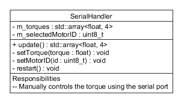

# SerialHandler

The serial handler offers manual control of the torques by reading commands received from the serial port.

The commands are:  
w: Increase the selected motor's torque by 1  
s: Decrease the selected motor's torque by 1  
d: Select the next motor ID  
a: Select the previous motor ID  
r: Restart the motherboard  

## Class overview

| Class | Responsibility |
|--------|---|
| `SerialHandler` | Reads commands from the serial port . | 

## Dependencies

No dependencies.

## Troubleshooting

No known issues.