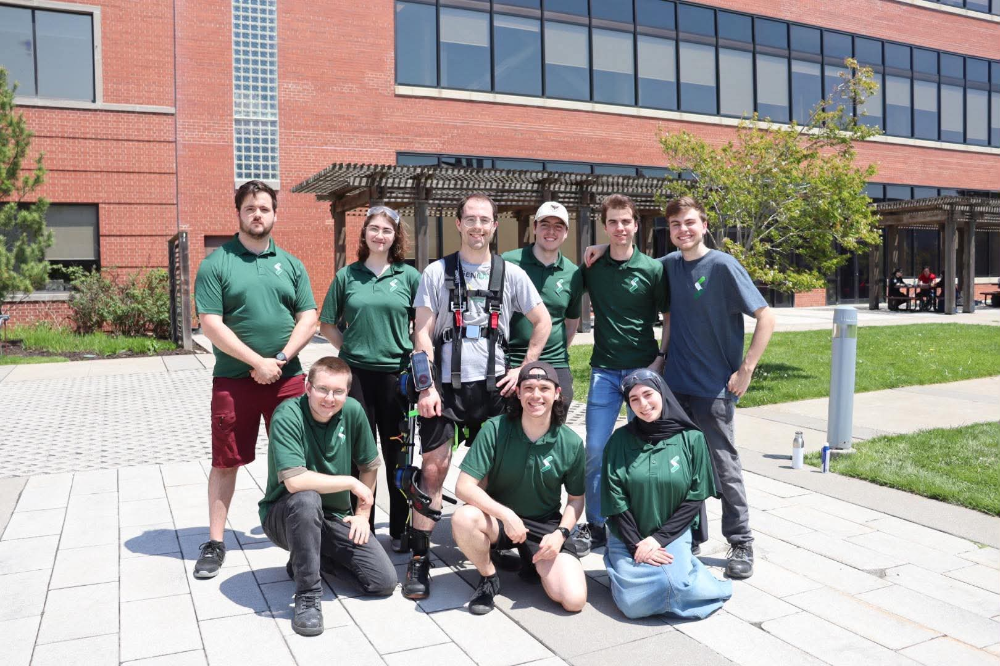
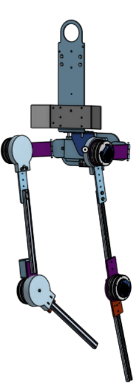

# Exo_Control

## Table of Contents

- [Our Team](#our-team)
- [Description](#description)
- [Project Overview](#project-overview)
- [Hardware](#hardware)
- [Getting Started](#getting-started)
- [Folder Overview](#folder-overview)
- [Development Notes](#development-notes)
- [License](#license)
- [Acknowledgments](#acknowledgments)
- [Authors](#authors)

## Our Team


## Description

**BioGenius** is a technical project within the Robotique UdeS group focused on designing a lightweight and powerful exoskeleton system. This system provides support to the legs, hips, and back, making walking and load handling easier. Our prototype helped the team secure first place at the Applied Collegiate Exoskeleton (ACE) Competition in the United States in both 2022 and 2023.

Founded in the fall of 2019 by two bioengineering enthusiasts, BioGenius has grown into a team of more than 10 members with expertise from several engineering disciplines. This project represents a pioneering effort at the undergraduate engineering level in Quebec.


Here is what our latest version looked like: 

<div style="text-align: center;">
  
</div>

## Hardware

The system is built around the following main hardware components:

- Microcontroller: Arduino ESP32 nano
- Inertial Measurement Units: BNO085
- Motor: CubemarsV2 AK10-9 KV100 and V3 AK10-9 KV60

## Getting Started

To get started with the project, clone the repository and build it with PlatformIO.

```bash
git clone https://github.com/robotique-udes/Exo_Control.git
cd Exo_Control
pio run
pio run -t upload
```

## Folder Overview

- [include](include): header files, class declarations, and shared configuration definitions
- [src](src): implementation files for the firmware, sensor handling, control logic, and motor control
- [docs](docs): development guidelines and supporting documentation
- [test](test): test-related files and future validation work
- [platformio.ini](platformio.ini): PlatformIO configuration for the embedded build

## Development Notes

The project follows the coding conventions documented in [docs/guideline/code_guideline.md](docs/guideline/code_guideline.md). In particular:

- use clear and descriptive names
- keep the code structure consistent
- document headers with Doxygen comments
- separate configuration, logic, and hardware interface concerns clearly

## License

Copyright (C) 2026,  Robotique UdeS

This program is free software: you can redistribute it and/or modify
it under the terms of the GNU General Public License as published by
the Free Software Foundation, either version 3 of the License, or
(at your option) any later version.

This program is distributed in the hope that it will be useful,
but WITHOUT ANY WARRANTY; without even the implied warranty of
MERCHANTABILITY or FITNESS FOR A PARTICULAR PURPOSE. See the
GNU General Public License for more details.

For more details, see <https://www.gnu.org/licenses/>.


## Acknowledgments

We invite you to explore the [Robotique UdeS website](https://robotiqueudes.ca/) to learn more about the team and discover other projects.

## Authors

The main contributors to the Exo_Control project are:

- Gabriel Desrochers
- Josseran-Pierre Gay
- Eloi Charbonneau
- Samuel Savaria
- Samuel Archambault
- Halima Bourdi
- Reem Youssef
- Édouard Moffet
- Jacob Turcotte
- Dannick Bilodeau
- Simon Trudeau
- Jorand Gagnon
